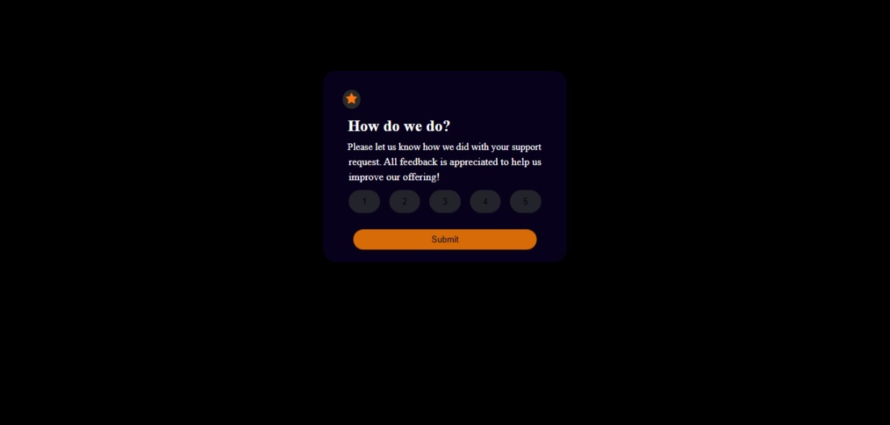

# Frontend Mentor - Interactive rating component solution

This is a solution to the [Interactive rating component challenge on Frontend Mentor](https://www.frontendmentor.io/challenges/interactive-rating-component-koxpeBUmI). Frontend Mentor challenges help you improve your coding skills by building realistic projects. 

- ### Overview
An Interactive rating component that allow user to rate from 1-5 star and display a thank you page,The component is builed with HTML,CSS and Javascript

Features
Interactive star rating
Dynamic display of a thank you page with the selected  rating
User-friendly design

  - [Screenshot](#)
  - [Links](https://github.com/aminuzainab/inspire-repo)
  - [Built with](#HTML,CSS and Javascript)
  - [Author](Zainab Aminu Mikail)
  - [Acknowledgments](#acknowledgments)

### Screenshot

### Links
- Solution URL: (https://github.com/aminuzainab/inspire-repo)
- Live Site URL:(https://aminuzainab.github.io/inspire-repo/)

### Built with
- Semantic HTML5 markup
- CSS custom properties
- Javascript

### What I learned
How to target a page to carry out an action by using document.getelement by id

## Author
- Website - (Zainab Aminu Mikail)
- Frontend Mentor - (@aminuzainab)
